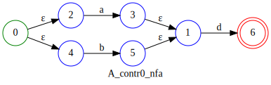
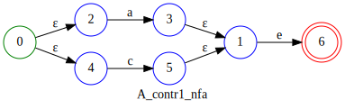
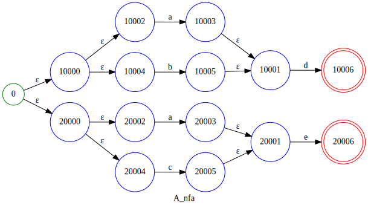
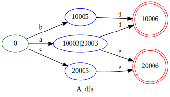

# Solving the _Rule Decision Problem_

## Preconditions

A parsing algorithm has to provide a strategy to decide which actual production should be applied when facing a certain sequence of input tokens. Let's call this the _Rule Decision Problem_.

The chosen approach defines the following `criteria` for a Context Free Grammar to be applicable.

* The grammar should not contain unreachable or unproductive non-terminals
* The grammar must not contain any left recursion
* The grammar must be k-augmented, which means that the start production of the grammar is appended with $k$ "end of grammar tokens". This way it is guaranteed that even a grammar that can produce an empty word will always produce at least $k$ tokens.

## Interpretation of data

Under the former mentioned preconditions you can interpret the first $k$ terminals that each production can produce as a regular language and thus enabling you to use the means of regular expressions to handle these data. To collect the aforementioned structure of produced terminals we can - figuratively spoken - unroll the non-terminals recursively, thereby producing a sort of circle free directed token-graph structure, until we have collected $k$ tokens in each path of the graph. Our postulated `criteria` of the grammar are especially required to make this process terminating.

You can find the regex-like data structure in the module LAAutomation.

```fsharp
    type LAData =
        | Item of LAItem
        | Union of Set<LAData>
        | Concat of LAData list
```

From its recursive definition you can conceive that it can represent graph like data.

## Decidability

For any non-terminal $N$ with $n > 1$ productions (the case $n = 1$ is trivial) you get a regular expression for each production $p_{i}^{N}|i=0..n-1$.

These $n$ regular expressions ($r_{i}^{N}|i=0..n-1$) can be directly converted into Nondeterministic Finite Automata (NFA), ($nfa_{i}^{N}|i=0..n-1$). By combining these $n$ NFAs with the Union Operation (similar to the regex | operator) you can reflect the situation present in the CFG where there are $n$ alternative productions for the non-terminal $N$.

$$
nfa_{combined}=\bigcup_{i=0}^{n-1} nfa_{i}^{N}
$$

The union operation I apply here performs two steps. It creates a new start state and adds an epsilon transition from this start state to each start state of $nfa_{i}$. Also it keeps track for each state in the combined NFA of its original production number.

*Note* that this union operation does *not* insert a new end state - making it different from the classical union operations performed on regex's.

The result is a NFA with states that hold besides their state number $s$ additionally the number of the production $i$ where it stems from.

The next step is to transform the combined NFA into a Deterministic Finite Automaton (DFA). This process usually creates DFA states from sets of NFA states. Since the NFA states contain the production number they originated from this information will be available in the DFA states too.

Here I introduce simple rules of how to decide whether the DFA can solve the _Rule Decision Problem_ when seeing a certain sequence of input tokens.
___

### Rule #1

The DFA is able to decide the problem of choosing a certain production number unambiguously only if all its accepting states contains NFA states of only one contributing production, i.e. the production numbers of the NFA states within each accepting state of the DFA must be equal.
___

### Rule #2

If the DFA is not able to decide the _Rule Decision Problem_ the number of lookahead tokens must be increased by one and the procedure must be repeated.

If the maximum number of lookahead tokens is reached the production to choose can't be predicted (with the given lookahead depth). This is usually a problem of the grammar formulation.
___

I won't give an exact prove for this here. Instead I will give an example.

## Example

Let's take a simple LL(2) grammar.

```ebnf
A = B | C;
B = ("a" | "b") "d";
C = ("a" | "c") "e";
```

It is LL(2) because both non-terminals $B$ and $C$ can start with a terminal "a".
So a _Rule Decision Problem_ exists for the non-terminal $A$.

Further let's assume that we can 'unroll' the productions $p_{i}^{A}|i=0..1$ , which is trivially possible in the given example:

$p_{0}^{A} = B$

B = ("a" | "b") "d";

$r_{0}^{A} = B = "(a|b)d" | \{a,b,d\}  \in T$
___

$p_{1}^{A} = C$

C = ("a" | "c") "e";

$r_{1}^{A} = C = "(a|c)e" | \{a,c,e\}  \in T$

___
Now we can transform the regular expression $r_{i}$ to NFAs $nfa_{i}$. Lets have a look at these NFAs.





___
And here is the combined NFA after applying the described union operation:



The state numbers are hexadecimal displayed and contain in the higher word the production number + 1. Please note that the production number is always relative within the productions of the non-terminal here.
___
Now let's have a look at the DFA generated from the combined NFA:



Here you can see that only intermediate states of the DFA contain contributing NFA states with differing production number. Actually there is exactly one 'ambiguous' state in the middle of the graph.

And additionally you can see that the accepting states contain only one contributing production number. Thus this Automaton can unambiguously decide the _Rule Decision Problem_. And for each production number there exists at least one accepting DFA state. In our example the state 10006 predicts production 0 and state 20006 predicts production 1.

Note that the DFA needs two lookahead terminals to reach an accepting state. This defines the lookahead of 2 tokens - the number 2 in LL(2).

If we would have taken only a lookahead of one the accepting states were those in the middle column in the DFA graph. And since we have an ambiguous state here in the center (10003|20003) this variant of the DFA would not satisfy rule #1.

This is the core algorithm of Lelek.
