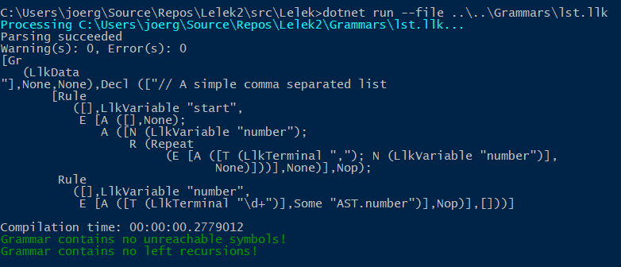

# Build the project

You can use your favorite editor or IDE. When you use Visual Studio >= 2015 you can simply build the solution as you're used to.
Visual Studio Code supports MSBuild builds from inside the editor via command palette.
On a shell or terminal you can call

```shell
    dotnet build
```

from your solutions folder.
This will automatically call `restore` for you to load all necessary dependencies.

## The first test

When built successfully you can just call the Lelek parser generator to get a feeling about how to use it in your own project.

Command line usage:

```shell
    cd src\Lelek
    dotnet run --file ..\..\Grammars\lst.llk
```

This will first check if the project is built correctly an then it will call the parser generator with the given grammar description file.
In this example we don't instruct the Lelek tool to generate any source code but rather we check the given file.
The tool will generate some output:



We see the structure of the parsed llk file and some messages that state the success of this first try.

Now lets have a look at the used grammar `lst.llk`.

```ebnf
(* A simple comma separated list *)
%grammar
start               = (* epsilon *)
                    | number { "," number }
;

number              = "\d+"             @AST.number
;
```

As you opened this file you may have noticed a newly appeared lst.svg file right beside the lst.llk.
This file is automatically generated by Lelek and has now the following content:


At the moment we can simply notice the fact that such a picture is kindly generated for us and ignore it.

Let's return to the `lst.llk`.

It shows us the basic structure of a LLK grammar description file.

The structure can be described informally as a collection of rules.
Each rule starts with an identifier followed by an equal sign. Right of the equal sign the productions are listed.
Productions are a list of (possibly empty) alternatives that are separated by bar characters (|).
Each rule must be terminated with a semicolon.

The complete description of the LLK syntax can be found here: [LLK Grammar](./LlkGrammar.md)

## Why so much output from Lelek tool

The Lelek executable is made for development an thus it is as verbose as necessary.
If you don't want so much clutter you can easily modify this tool to fit your own taste or even create a new command line tool that calls the functions provided by the LelekParser library.

## What's next

* [LLK Grammar](./LlkGrammar.md)
* [The list example](./ListExample.md)
